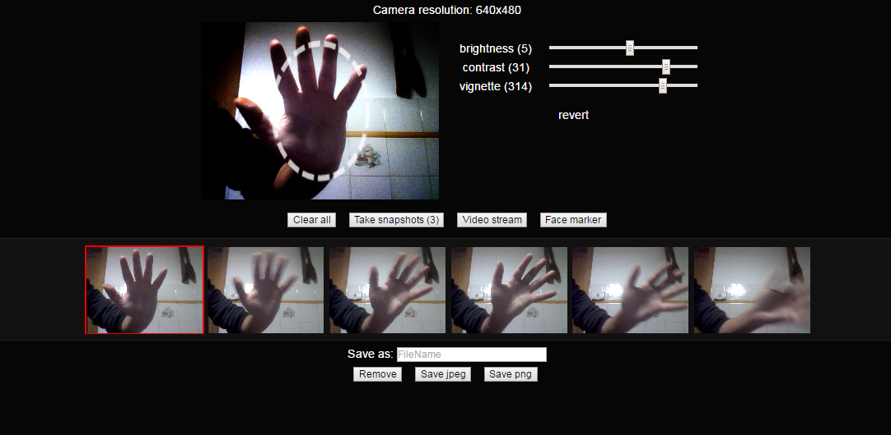

# WebPhoto
Customized [Jpeg Camera](https://github.com/amw/jpeg_camera) demo.

What it does:

 - not much, but...
 - applies some image filters using [CamanJS](http://camanjs.com/)
 - can save the result on your device
 - can be easily run locally (without an internet connection)

[online demo](https://rawgit.com/azrafe7/WebPhoto/master/index.html)

### Why?
I needed a minimal photo booth app that could also apply some simple filters/effects, and save the results locally.
This thing tries to do exactly that.

### Something isn't working
Please open a new issue [here](https://github.com/azrafe7/WebPhoto/issues), I'll be glad to help.

### License
See [LICENSE](LICENSE) file.